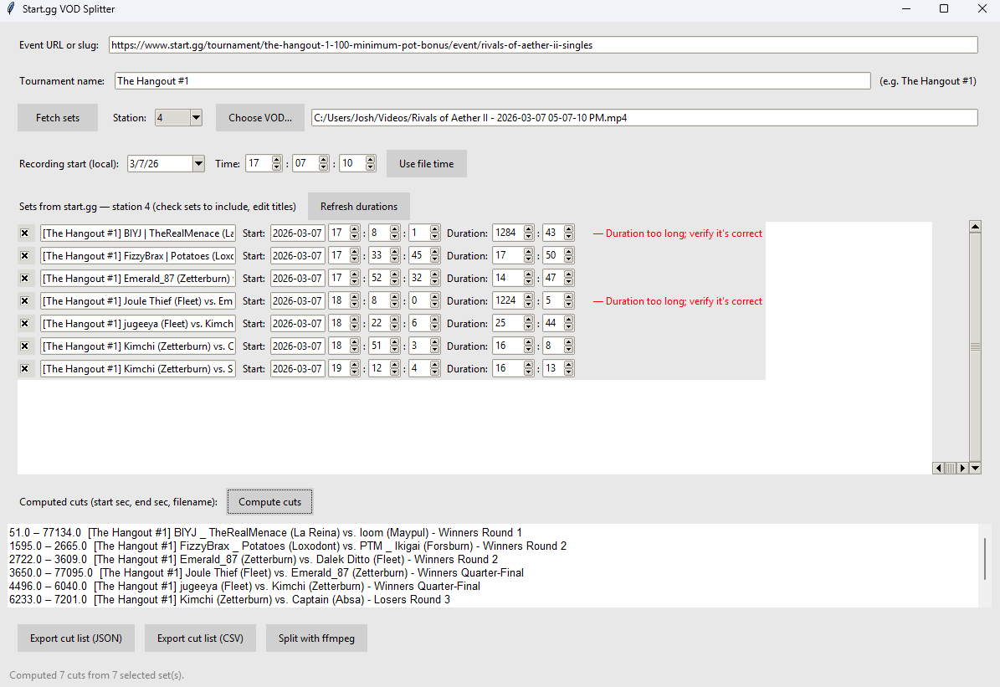
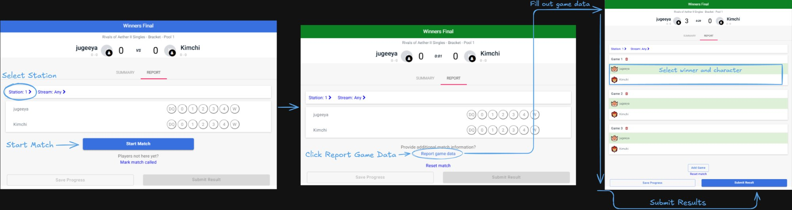

# Start.gg VOD Splitter

Small desktop app for turning a VOD into per-set clips using start.gg set times. Use one PC/station per run: pick the event, station number, and VOD file, and the app will compute cut times and can split into output video files automatically with video titled filenames!



## Usage

This tool can work very well for either single-stream/recording setups, or even multi-recording setups! We created this for use at our monthly SoCal series [The Hangout](start.gg/thehangout), which currently has 4 recording setups, in order to support recording all winner's side and top 8 sets. 

### What To Do During Your Tournament

The overall idea for this tool is to automate VOD splitting by moving the VOD marking process instead to the ***start.gg match result submission time.*** If you can be somewhat disciplined with this portion, you can save yourself a lot of time splitting the vod after the tournament is over!

#### Tournament Workflow / Notes
1) **Use start.gg's `Start Match` exactly when you call the match OR as close to true match start as possible.** start.gg will store this start time in its database for use in the splitter program later. If you do it when you call the match initially, you'll have some initial headroom in the video for however long it takes the players to start the game, but it's easier as an organizer who can't watch for exactly when it starts.
2) **When a match ends, submit results ONLY once you have confirmed all of the following information:**
  - Game count is correct
  - Character data is correct
  - Station number is correct

The moment you hit `Submit Results`, start.gg takes that as the end time to be stored in its database to be used as the end time for your split vod later. The reason it is important to get the above information *before* is that if those are updated afterwards, the end time for the set is also updated on start.gg. If you must do this, you will likely run into the `Set too long` warning listed below, where you'll simply have to manually set the end time or duration of that set.



### Recording Types

#### Twitch VODs
- I use [Twitch VOD Downloader](https://chromewebstore.google.com/detail/twitch-vod-downloader/gaabmdjigfcnkgeommfpnoinpdmpfhaj?hl=en) to get a `.chunked.ts` file to work with. Its UI also gives the start time of the VOD.
- `ffmpeg -i in.ts -c copy out.mp4`: Turn a Twitch VOD chunked file into a file compatible with this program.

#### OBS Recordings
These work out of the box! For the easiest experience, use the default OBS naming scheme that contains the timestamp, so you know for sure when the VOD started for use in the program later.

### One-Time Setup
1) Install ffmpeg. On Windows, can just open Terminal and do `winget install ffmpeg`. It may be better to restart your computer so you ensure it's in your PATH.

<details><summary>If that doesn't work, click here for an alternative manual installation method:</summary>

### Manual ffmpeg Installation

- Go to https://ffmpeg.org/download.html.
- Download the Windows build (static or shared).
- Extract it to a location like `C:\ffmpeg`.

#### Add to System Path
- Press Win + X and select "System".
- Click "Advanced system settings" (or search for "Environment Variables").
- Click "Environment Variables" button (bottom right).
- Under "System variables," select "Path" and click "Edit".
- Click "New" and add the path to your FFmpeg bin folder (e.g, `C:\Users\computerusername\AppData\Local\Microsoft\WinGet\Packages\Gyan.FFmpeg_Microsoft.Winget.Source_8wekyb3d8bbwe\ffmpeg-8.0.1-full_build\bin`)
- Click OK on all dialogs.
- Restart your computer (or restart your terminal/IDE).

#### Verify that it worked
- Open Command Prompt or Powershell.
- Type `ffmpeg -version`. If it worked, it'll show version information.
- Restart your computer.
</details>
<br>

2) Download the `startgg-vod-splitter` exe from releases: https://github.com/jugeeya/startgg-vod-splitter/releases

### Workflow
1) Open the app, set "Event slug" to the event URL (after start.gg; example: `tournament/the-hangout-1-100-minimum-pot-bonus/event/rivals-of-aether-ii-singles`) and "Tournament Name" to your tournament's name (example: `The Hangout #1`).
2) Click `Fetch Sets`.
3) Change the station dropdown to your station number (e.g. 3)
4) Click `Choose VOD` and put the full OBS file.
5) It'll pre-fill "Recording start", but if it doesn't match the OBS filename hour:minutes:seconds, change it to match the filename! You'll likely need to do this.

At this point, if you see:
$\color{#f00}{\textsf{Set too long -- may have incorrect end time}}$

Go into the vod and find the right duration and edit it. The start time will at least be correct so you can start there. In the VOD, you can usually see the current time in the top right for Rivals of Aether 2. If you update any times this way, click `Refresh Durations`.

6) Click `Compute Cuts`. 
7) Click `Split with ffmpeg` and choose an output folder.

## Development

### Environment Setup
1. **Install Python 3.10+** and create a virtualenv (recommended):
   ```bash
   python3 -m venv .venv
   source .venv/bin/activate   # Windows: .venv\Scripts\activate
   pip install -r requirements.txt
   ```
   Minimum: `pip install requests`. The app will use standard Tkinter. Install `customtkinter` as well for a darker, modern look.

2. **Run the app**
   - **macOS / Linux:** From project root, `python3 -m src.main` (or `./run.sh`).
   - **Windows:** From project root in Command Prompt or PowerShell: `py -3 -m src.main` or `python -m src.main`. Or double‑click `run.bat` (after installing Python and dependencies).

## Building the Windows exe

To build a standalone `.exe` (no Python install needed on the target PC):

1. **Locally (Windows):** Install Python 3.11+, then from the project root:
   ```bat
   pip install -r requirements.txt pyinstaller
   pyinstaller --noconfirm StartGG-VOD-Splitter.spec
   ```
   The exe is written to `dist/StartGG-VOD-Splitter.exe`. Copy it (and optionally ffmpeg) to any Windows machine.

2. **GitHub Actions:** On every push to `main`/`master`, a workflow builds the exe and uploads it as an artifact. In your repo: **Actions** → **Build Windows exe** → select the latest run → **Artifacts** → download **StartGG-VOD-Splitter-Windows** (contains the exe). You can also trigger the workflow manually from the **Actions** tab (**Run workflow**).

## Project layout

- `run.py` – entry point for PyInstaller (also `python -m src.main`)
- `StartGG-VOD-Splitter.spec` – PyInstaller spec for the Windows exe
- `src/main.py` – GUI
- `src/startgg.py` – start.gg GraphQL client
- `src/vod.py` – VOD start time and cut list / ffmpeg split
- `PLAN.md` – design and scope

## License

Use and modify as you like.
